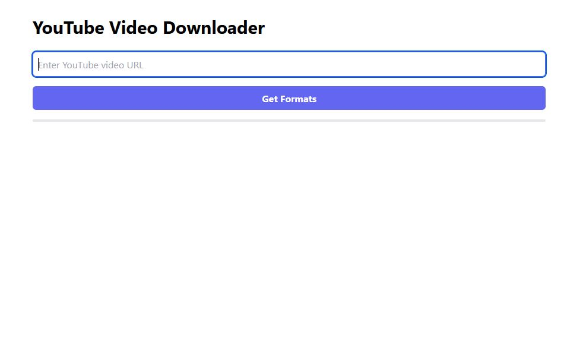
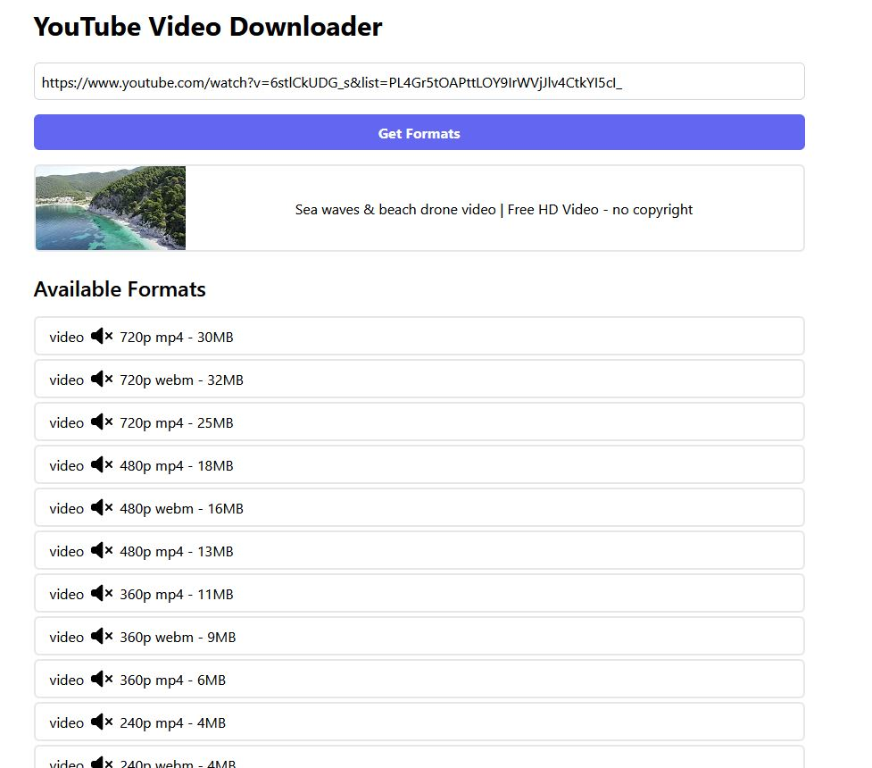

# youtube-download

This repository contains the frontend code for a web application that for downloading YouTube videos.
Prerequisites

    Node.js and npm (or yarn) installed

## Website

https://yytdownload.netlify.app/

## Installation

Clone this repository:

    git clone https://github.com/younessoub/youtube-download.git

## Install dependencies:

    npm install

## Running the application

    npm run build
    npm run preview

## Features

    Display video title, thumbnail, available formats, and more.
    Download video in different formats.

## Screenshots

## Contributing

If you want to contribute to this project, please fork the repository and submit a pull request.
License

This project is licensed under the MIT License. See the LICENSE file for details.
